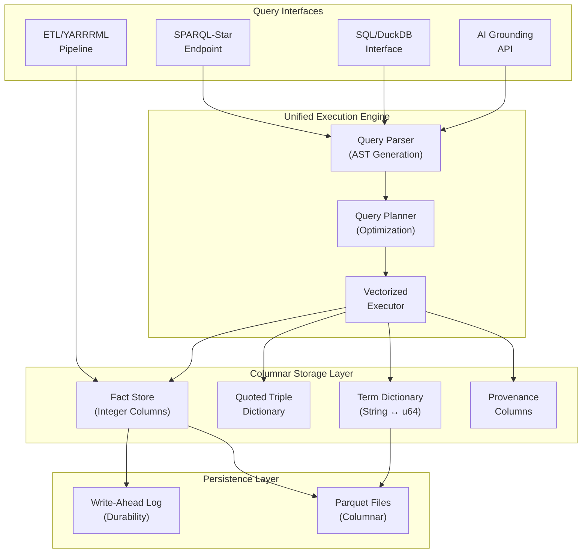
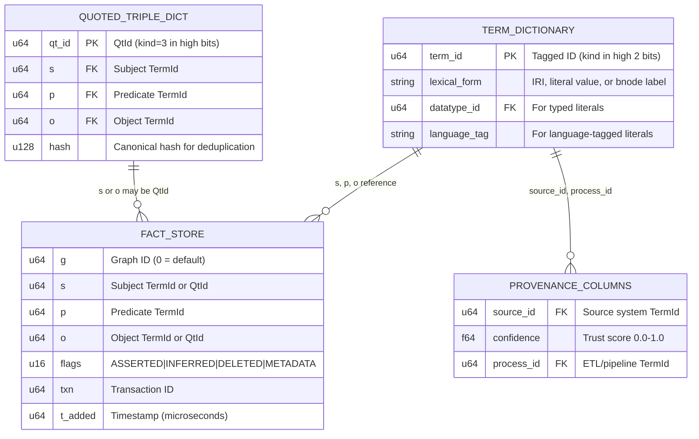
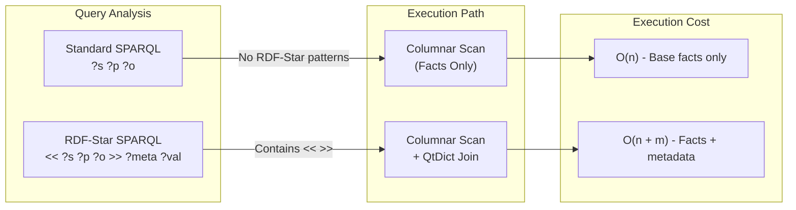
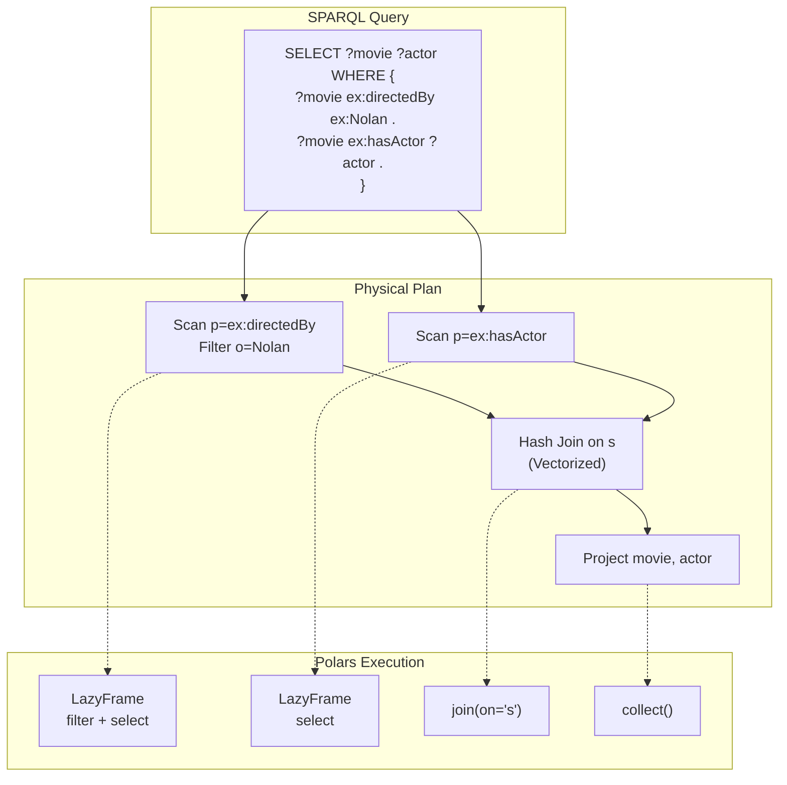
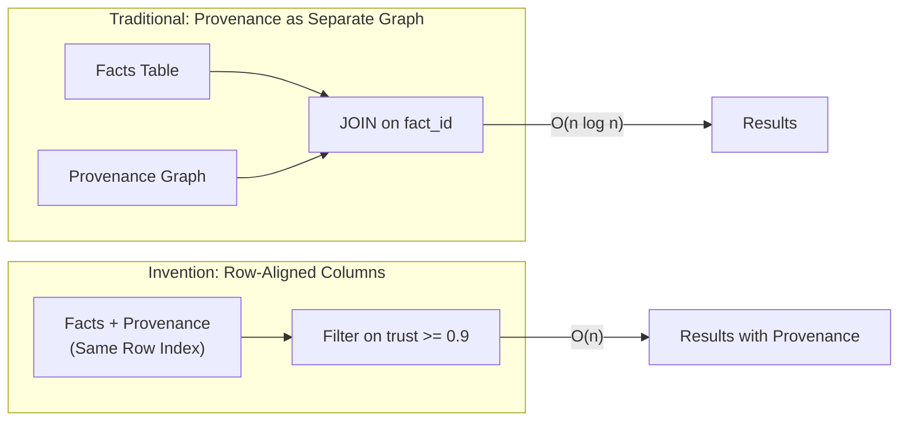
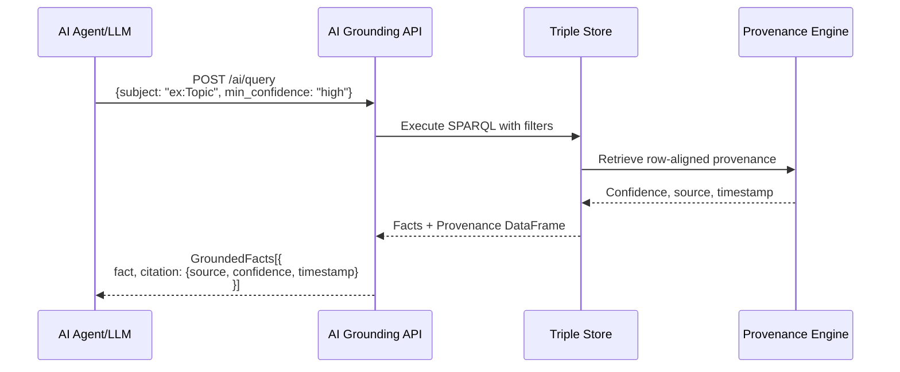
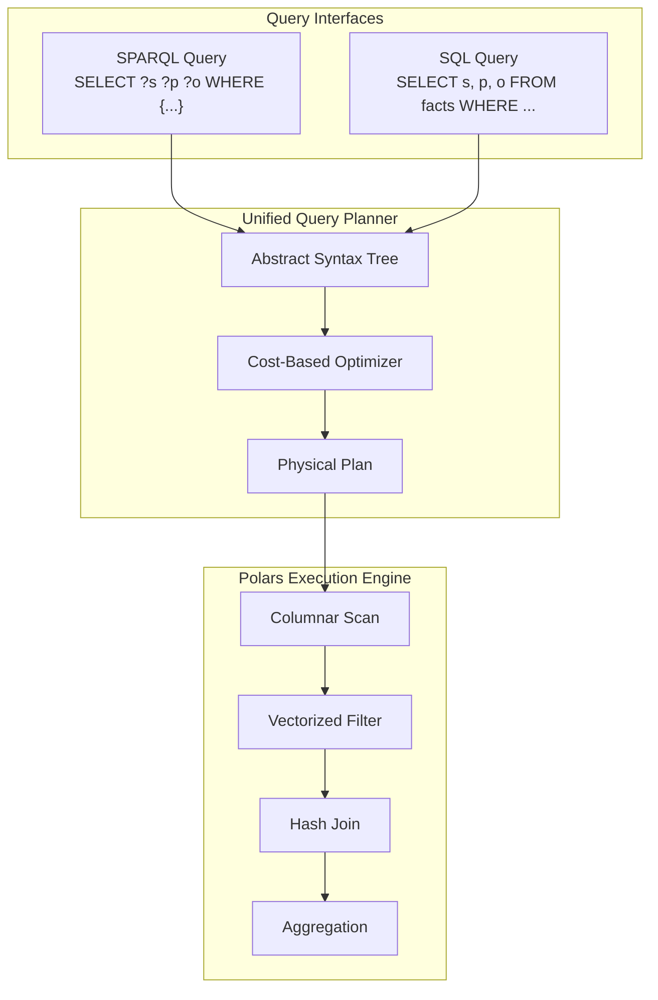
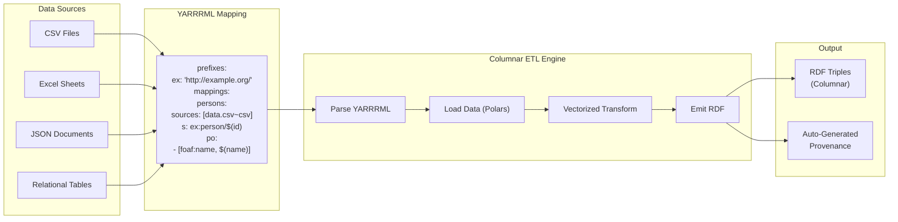
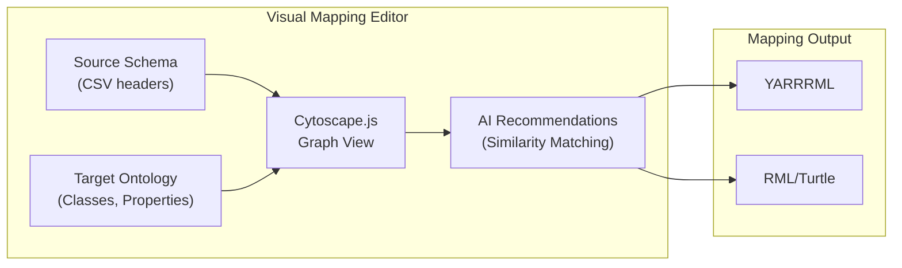

# RDF-StarBase: Technical Invention Disclosure

**Columnar Execution of RDF and RDF-Star with Conditional Semantic Materialization**

---

## 1. Technical Field

The invention relates to graph data management systems, and more specifically to methods and systems for representing, indexing, and executing RDF and RDF-Star (RDF★) queries using a columnar analytical data model. The invention further relates to query execution architectures that unify graph and relational semantics over a shared physical storage substrate, and to methods for AI-auditable provenance propagation through query execution.

---

## 2. Background and Problems in the Prior Art

### 2.1 Limitations of Traditional RDF and RDF-Star Systems

Existing RDF databases and SPARQL engines are fundamentally graph-centric systems. They typically store triples as:

- Row-oriented triple tables
- Pointer-based graph structures
- Index permutations over subject–predicate–object combinations (SPO, PSO, OSP)

When RDF-Star is introduced, these systems generally handle quoted triples by:

- Treating quoted triples as first-class graph entities
- Materializing annotations as additional triples
- Reifying or normalizing RDF-Star data into internal graph structures

This approach introduces several well-known limitations:

| Limitation | Description |
|------------|-------------|
| **Uniform overhead** | RDF-Star metadata is stored and indexed even when queries do not reference it |
| **Execution inefficiency** | Graph-native traversal and join strategies do not benefit from vectorized or batch execution |
| **Storage inflation** | Annotated triples increase physical storage and index size regardless of usage |
| **Tight coupling** | Semantic expressiveness directly increases storage and execution cost |

As a result, RDF systems struggle to scale efficiently for analytical workloads, especially when RDF-Star annotations, provenance data, or ontology metadata are present.

### 2.2 Separation of Graph and Analytical Systems

Analytical engines (e.g., columnar databases) excel at:

- Vectorized execution (SIMD operations)
- Batch joins and filtering
- High-throughput analytical queries
- Predicate pushdown and partition pruning

However, they traditionally lack:

- Native RDF or SPARQL semantics
- Graph pattern matching
- Support for RDF-Star or semantic annotations
- Provenance-aware query execution

Prior systems that attempt to bridge this gap typically:

- Translate RDF into relational schemas (losing semantic fidelity)
- Duplicate data across storage models
- Use separate execution engines for SQL and SPARQL

These approaches introduce data duplication, semantic loss, or execution overhead.

### 2.3 Provenance as an Afterthought

Traditional systems treat provenance and governance metadata as:

- Separate graphs requiring additional joins
- External lineage tables reconstructed after query execution
- Optional annotations evaluated post-processing

This creates significant friction for governance-critical and AI-auditable workloads.

### 2.4 Survey of Prior Art and Differentiation

The following table surveys relevant prior art and explicitly identifies how the present invention differs:

| Prior Art | Description | How This Invention Differs |
|-----------|-------------|---------------------------|
| **Virtuoso** (OpenLink) | Column-wise RDF storage with bitmap indexes and SQL/SPARQL dual interface | Virtuoso predates RDF-Star; stores provenance in named graphs requiring joins; does not provide conditional metadata materialization |
| **Apache Jena TDB/TDB2** | Permuted index storage (SPO, POS, OSP) with journal transactions | Row-oriented index model; not columnar; no native vectorized execution; RDF-Star via additional triples |
| **GraphDB** (Ontotext) | RDF-Star support via embedded triple representation | Materializes all RDF-Star annotations uniformly; provenance via named graphs not row-aligned columns |
| **Stardog** | Knowledge graph platform with RDF-Star and reasoning | Proprietary; RDF-Star stored as additional graph structures; provenance not integrated into execution path |
| **Blazegraph** | B+Tree storage with SPARQL federation | Now unmaintained; no columnar execution; no RDF-Star; provenance via reification |
| **RDF reification (W3C standard)** | Statement-about-statement via rdf:Statement, rdf:subject, rdf:predicate, rdf:object | Requires 4+ additional triples per annotation; significant storage and query overhead |
| **Named graphs for provenance** | Using SPARQL GRAPH clause to isolate provenance data | Requires runtime joins between fact and provenance graphs; O(n log n) vs. O(n) |
| **DuckDB RDF Extension** | SPARQL-to-SQL translation over columnar storage | Translation layer loses semantic fidelity; no native RDF-Star; no provenance integration |
| **US Patent 8,484,234** (Oracle) | RDF data lifecycle management with parallel processing | Focuses on batch loading and archival; not on query-time conditional materialization |
| **US Patent 9,477,730** (Franz Inc.) | Named graph partitioning for RDF | Addresses partitioning, not columnar execution or row-aligned provenance |

**Summary of Novel Elements:**

1. **Conditional RDF-Star Materialization:** Prior systems materialize quoted triple metadata uniformly. This invention conditionally resolves RDF-Star semantics only when query patterns reference them.

2. **Row-Aligned Provenance:** Prior systems store provenance in separate graphs or tables requiring joins. This invention stores provenance as columns aligned to assertion rows, enabling O(n) access without joins.

3. **Tagged Term ID Encoding:** The use of high-order bits in u64 identifiers to encode term kind (IRI, Literal, BNode, QuotedTriple) enabling O(1) type discrimination is not found in surveyed prior art.

4. **Unified SPARQL/SQL Execution:** Prior systems either translate between query languages or maintain separate execution engines. This invention compiles both to the same columnar operators over a shared substrate.

---

## 3. Summary of the Invention

The invention provides a columnar, analytical execution architecture for RDF and RDF-Star data in which:

1. **RDF triples are stored in columnar form** with dictionary-encoded integer identifiers
2. **RDF-Star (quoted triple) semantics are handled conditionally** at execution time
3. **Graph query patterns are executed using analytical operators** (vectorized joins, columnar scans)
4. **Provenance metadata is stored as row-aligned columns** alongside assertion data
5. **Multiple query interfaces** (SPARQL and SQL) execute over the same columnar substrate
6. **AI grounding APIs** provide structured fact retrieval with full citation chains

The system decouples semantic expressiveness from physical storage cost, enabling high-performance analytical querying of RDF and RDF-Star data without imposing unnecessary overhead on non-RDF-Star workloads.

---

## 4. System Architecture Overview

### 4.1 High-Level Architecture



### 4.2 Columnar Representation of RDF Data (Core Invention A)

Base RDF data is represented as columnar structures with dictionary-encoded integer identifiers:



**Term ID Encoding:**

The invention uses a tagged identifier space where the high 2 bits encode term kind:

| Kind | Binary Prefix | Description |
|------|---------------|-------------|
| IRI | `00` | Named resources |
| Literal | `01` | Typed/language literals |
| Blank Node | `10` | Anonymous nodes |
| Quoted Triple | `11` | RDF-Star quoted statements |

This enables O(1) term kind detection without dictionary lookup:

```python
def get_term_kind(term_id: u64) -> TermKind:
    return TermKind((term_id >> 62) & 0x3)  # Extract high 2 bits
```

### 4.3 Conditional RDF-Star Semantic Materialization (Core Invention B)

RDF-Star annotations (quoted triples and their associated metadata) are **not universally materialized** into the base data representation.

Instead:

1. **RDF-Star metadata is stored separately** in the Quoted Triple Dictionary
2. **Queries that do not reference RDF-Star semantics bypass this metadata entirely**
3. **RDF-Star semantics are resolved only when explicitly referenced** by a query pattern



This enables **pay-as-you-go semantic enrichment**, where:

- Standard RDF queries incur no RDF-Star overhead
- RDF-Star queries selectively activate quote resolution
- Storage cost is proportional to actual metadata usage

---

## 5. Analytical Execution of Graph Queries (Core Invention C)

### 5.1 Graph-to-Analytical Query Transformation

SPARQL and SPARQL-Star graph patterns are transformed into analytical query plans composed of:

- Columnar scans with predicate pushdown
- Vectorized hash joins on integer IDs
- Batch filtering operations using SIMD



Graph semantics are preserved while avoiding:

- Pointer chasing (replaced by integer ID comparisons)
- Row-by-row execution (replaced by vectorized operations)
- Graph traversal primitives (replaced by columnar joins)

### 5.2 Unified Execution Engine

The same execution engine processes:

- Base RDF pattern matching
- RDF-Star annotation resolution
- Ontology and provenance constraints
- RDFS/OWL reasoning (forward-chaining materialization)

All operations are expressed in terms of columnar operators, allowing:

- Shared execution paths
- Consistent optimization strategies
- Predictable performance characteristics

---

## 6. Provenance as First-Class Execution Dimension (Core Invention D)

### 6.1 Row-Aligned Provenance Storage

Unlike systems that store provenance as separate graphs requiring additional joins, the invention stores provenance metadata as **row-aligned columns** alongside assertion data:



### 6.2 Provenance Propagation Rules

The invention defines deterministic rules for combining provenance through query operations:

| Operation | Provenance Rule |
|-----------|-----------------|
| **Join** | `trust = min(left.trust, right.trust)` |
| **Filter** | Preserve provenance of filtered rows |
| **Union** | Set union of source identifiers |
| **Aggregate** | Aggregate provenance (min trust, max timestamp) |

Provenance is computed **during execution**, not retrofitted after the fact.

### 6.3 AI Grounding API

The invention includes a specialized API layer for AI/LLM consumption:



This enables:

- **Retrieval-Augmented Generation (RAG)** with full citation chains
- **Claim verification** against the knowledge base
- **Trust-filtered queries** (e.g., only facts with confidence ≥ 0.9)
- **Freshness filtering** (e.g., facts from last 30 days)

---

## 7. Dual SPARQL and SQL Interface (Extension 1)

### 7.1 Problem Addressed

Traditional systems supporting both SPARQL and SQL require:

- Separate storage representations
- Data duplication
- Translation layers between models

### 7.2 Unified Interface Architecture

In the invention, both SPARQL and SQL queries are mapped to the same columnar execution engine:



No separate relational materialization is required. SQL queries operate over the same physical data structures used by SPARQL.

---

## 8. Semantic Retrofit via Declarative Mappings (Extension 2)

### 8.1 Mapping-Based Ingestion

The invention supports semantic alignment of existing tabular data without requiring data migration:



### 8.2 Automatic Provenance Population

During ingestion, when provenance attributes are absent from source data, the system automatically populates:

- Batch/workflow identifiers
- Ingestion timestamps
- Mapping version identifiers
- Default trust scores based on source configuration

### 8.3 Visual Mapping Tool (StarChart)

The invention includes a visual mapping interface that:

- Displays source schema alongside target ontology
- Recommends property mappings using string similarity
- Generates YARRRML/RML mapping specifications
- Validates mappings against SHACL shapes



---

## 9. RDFS/OWL Reasoning Engine (Extension 3)

The invention includes a forward-chaining reasoning engine operating directly on the integer-based storage:

### 9.1 Supported Entailment Rules

**RDFS Rules:**

| Rule | Pattern | Inference |
|------|---------|-----------|
| rdfs2 | `(x p y) ∧ (p rdfs:domain C)` | `(x rdf:type C)` |
| rdfs3 | `(x p y) ∧ (p rdfs:range C)` | `(y rdf:type C)` |
| rdfs9 | `(x rdf:type C1) ∧ (C1 rdfs:subClassOf C2)` | `(x rdf:type C2)` |
| rdfs11 | `(C1 rdfs:subClassOf C2) ∧ (C2 rdfs:subClassOf C3)` | `(C1 rdfs:subClassOf C3)` |

**OWL 2 RL Rules:**

| Rule | Pattern | Inference |
|------|---------|-----------|
| owl:inverseOf | `(x p y) ∧ (p owl:inverseOf q)` | `(y q x)` |
| owl:TransitiveProperty | `(x p y) ∧ (y p z) ∧ (p a owl:TransitiveProperty)` | `(x p z)` |
| owl:SymmetricProperty | `(x p y) ∧ (p a owl:SymmetricProperty)` | `(y p x)` |

### 9.2 Inference Tracking

Inferred triples are marked with the `INFERRED` flag, enabling:

- Distinction between asserted and derived facts
- Incremental re-materialization on ontology changes
- Provenance tracking of inference chains

---

## 10. Technical Advantages and Improvements

| Improvement | Prior Art | Invention |
|-------------|-----------|-----------|
| **Storage overhead** | RDF-Star metadata universally materialized | Conditional materialization (pay-as-you-go) |
| **Execution performance** | Pointer-based graph traversal | Vectorized columnar operators |
| **Provenance access** | Separate joins to lineage tables | Row-aligned provenance columns |
| **Multi-paradigm queries** | Separate engines for SPARQL/SQL | Unified columnar executor |
| **Semantic retrofit** | Requires data migration | Declarative mapping-based ingestion |
| **AI auditability** | Post-hoc lineage reconstruction | Provenance flows through execution |

---

## 11. Example Use Cases

1. **Analytical RDF querying at scale** — OLAP-style queries over knowledge graphs
2. **Provenance-aware data governance** — Trust-filtered queries with audit trails
3. **Hybrid semantic + relational analytics** — Single substrate for KG and BI workloads
4. **RDF-Star annotation analysis** — Efficient metadata queries without graph bloat
5. **AI grounding for LLMs** — RAG with full citation chains and confidence scores
6. **Enterprise knowledge graphs** — Semantic layer over existing data lakes

---

## 12. Claims

The following claims are presented in a format suitable for patent prosecution. Independent claims establish the broad scope; dependent claims narrow scope with additional limitations.

### Independent Claim 1: Conditional RDF-Star Materialization

**1.** A computer-implemented method for storing and querying RDF-Star data, comprising:

(a) receiving a plurality of RDF statements, each statement comprising a subject, predicate, and object;

(b) encoding each term (subject, predicate, object) as an integer identifier within a dictionary, wherein said integer identifier comprises:
- a term kind indicator encoded in the high-order bits of said integer identifier, enabling O(1) determination of whether said term is an IRI, literal, blank node, or quoted triple;
- a sequential index in the remaining bits referencing the term's lexical representation in said dictionary;

(c) storing said RDF statements as rows in a columnar data structure, wherein each row comprises integer identifier columns for subject, predicate, object, and graph context;

(d) storing RDF-Star quoted triple structures in a separate quoted triple dictionary, referenced by said integer identifiers when the term kind indicator specifies a quoted triple;

(e) upon receiving a query:
- analyzing said query to determine whether it references RDF-Star semantics;
- if said query does not reference RDF-Star semantics, executing said query using only the columnar data structure without accessing the quoted triple dictionary;
- if said query references RDF-Star semantics, joining the columnar data structure with the quoted triple dictionary to resolve quoted triple references;

whereby queries that do not reference RDF-Star semantics incur no overhead from RDF-Star metadata storage.

### Independent Claim 2: Row-Aligned Provenance Storage

**2.** A computer-implemented system for provenance-aware graph query execution, comprising:

(a) a fact store comprising a columnar data structure wherein each row represents an RDF statement and comprises:
- integer identifier columns for subject, predicate, object, and graph context;
- one or more provenance columns aligned to the same row index, said provenance columns comprising at least one of: source identifier, confidence score, timestamp, or process identifier;

(b) a query execution engine configured to:
- receive a graph pattern query specifying one or more triple patterns;
- translate said graph pattern query into columnar operations comprising scans, filters, and joins on integer identifier columns;
- propagate provenance columns through said columnar operations according to deterministic rules, wherein:
  - for join operations, the resulting provenance reflects a conservative combination of input provenances (e.g., minimum confidence);
  - for filter operations, provenance of surviving rows is preserved;
  - for union operations, provenance sources are aggregated;

(c) an output interface configured to return query results comprising both semantic bindings and associated provenance metadata without requiring additional joins to external lineage tables;

whereby provenance is accessed in O(n) time as a direct column read rather than O(n log n) time via separate table joins.

### Independent Claim 3: Unified SPARQL/SQL Execution

**3.** A computer-implemented apparatus for multi-paradigm query execution over RDF data, comprising:

(a) a columnar storage layer comprising:
- a term dictionary mapping string representations of RDF terms to integer identifiers;
- a fact store comprising columnar arrays of integer identifiers representing RDF statements;

(b) a query interface layer configured to receive queries in at least two distinct query languages, said languages comprising:
- a graph pattern query language (SPARQL) specifying triple patterns with variables;
- a relational query language (SQL) specifying table operations with column references;

(c) a query compiler configured to translate queries from both said query languages into a common intermediate representation comprising columnar operations;

(d) a vectorized execution engine configured to execute said common intermediate representation using SIMD-accelerated operations on integer identifier columns;

whereby queries expressed in SPARQL and queries expressed in SQL over the same data produce equivalent results and share the same execution infrastructure without data duplication.

### Dependent Claims

**4.** The method of claim 1, wherein the term kind indicator is encoded in the two highest-order bits of a 64-bit unsigned integer, providing four term kinds: IRI (00), Literal (01), Blank Node (10), and Quoted Triple (11).

**5.** The method of claim 1, wherein the columnar data structure is persisted using a columnar file format supporting predicate pushdown and partition pruning, such as Apache Parquet.

**6.** The method of claim 1, further comprising a flags column in the columnar data structure, wherein said flags column comprises bit indicators for: ASSERTED, INFERRED, DELETED, and METADATA.

**7.** The system of claim 2, wherein the confidence score is a floating-point value between 0.0 and 1.0, and wherein queries may specify a minimum confidence threshold that is applied as a predicate filter during query execution.

**8.** The system of claim 2, further comprising an AI grounding API configured to:
- receive structured fact retrieval requests specifying entity identifiers and optional confidence thresholds;
- execute graph pattern queries with provenance propagation;
- return results in a format suitable for retrieval-augmented generation, wherein each fact includes citation metadata comprising source, confidence, and timestamp.

**9.** The system of claim 2, further comprising a reasoning engine configured to:
- apply forward-chaining inference rules (RDFS, OWL 2 RL) over the columnar data structure;
- store inferred statements with a distinct INFERRED flag in the flags column;
- track inference provenance separately from asserted provenance.

**10.** The apparatus of claim 3, wherein the vectorized execution engine is implemented using a dataframe library (e.g., Polars, Pandas, DataFusion) and executes hash joins on integer identifier columns.

**11.** The apparatus of claim 3, further comprising a declarative mapping ingestion system configured to:
- receive mapping specifications (R2RML, RML, YARRRML) defining correspondences between source data fields and semantic model elements;
- transform source data records into RDF statements using vectorized operations;
- automatically populate provenance columns based on ingestion context (source identifier, timestamp, mapping version).

**12.** The method of claim 1, wherein the quoted triple dictionary comprises:
- a quoted triple identifier (QtId);
- integer identifier columns for the quoted subject, predicate, and object;
- a canonical hash enabling deduplication of structurally equivalent quoted triples.

**13.** The system of claim 2, wherein provenance propagation rules are configurable, enabling alternative combination strategies such as:
- maximum confidence (optimistic);
- average confidence (balanced);
- custom aggregation functions.

---

## 13. Conclusion

The invention introduces a novel execution and representation architecture for RDF and RDF-Star systems that:

- Separates semantic expressiveness from physical cost
- Enables analytical execution of graph queries
- Supports conditional semantic materialization
- Unifies graph and relational interfaces over a columnar substrate
- Treats provenance as a first-class execution dimension

This architecture addresses long-standing performance and scalability challenges in RDF and RDF-Star systems while preserving full semantic fidelity and enabling AI-auditable data governance.

---

*End of Technical Disclosure*

**Document Version:** 2.0  
**Last Updated:** February 2026  
**Status:** Draft for Review
