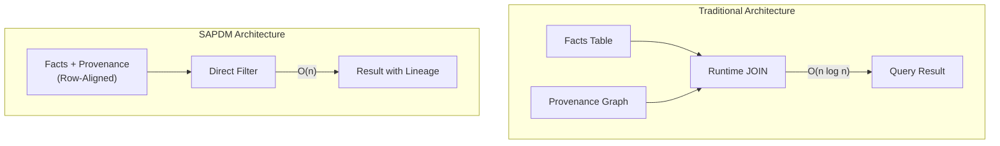
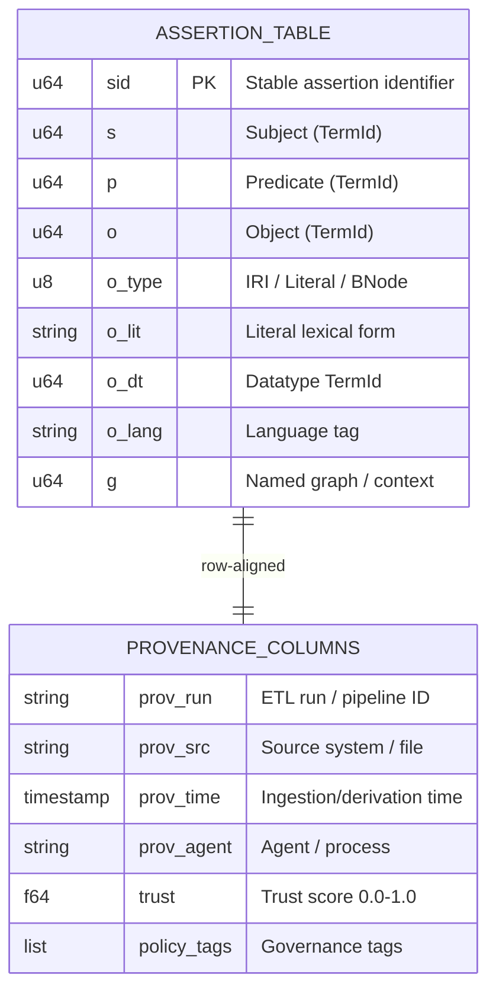
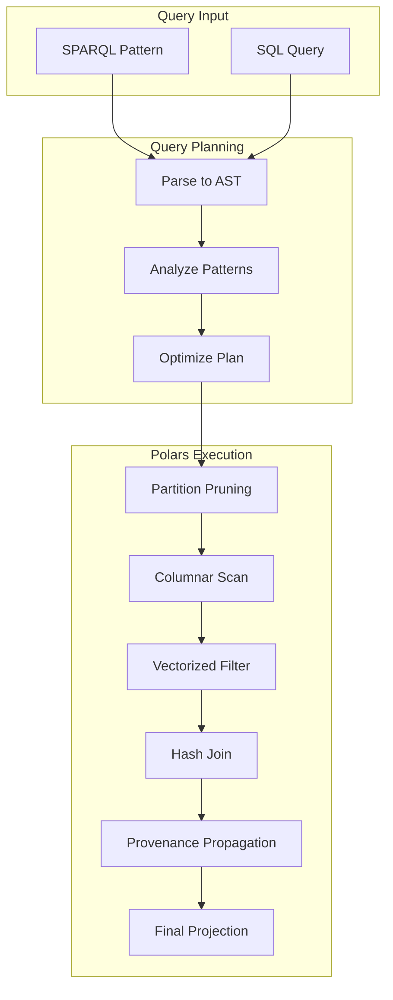
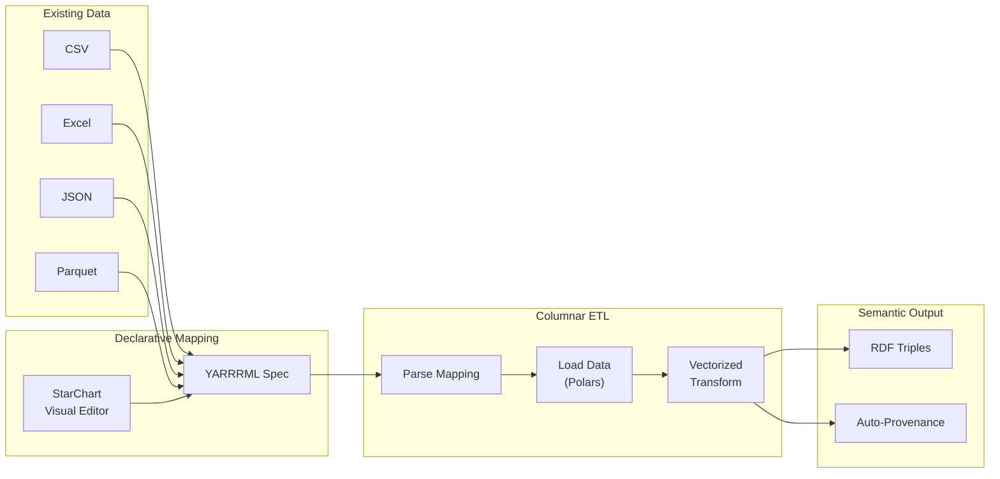
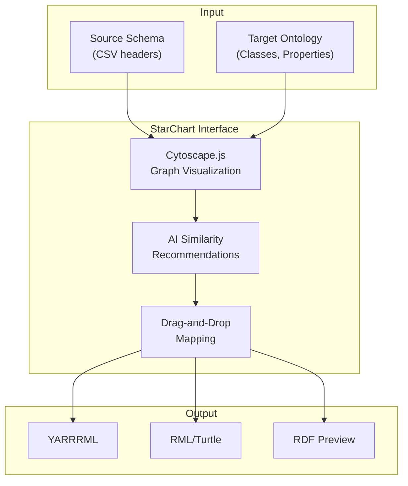
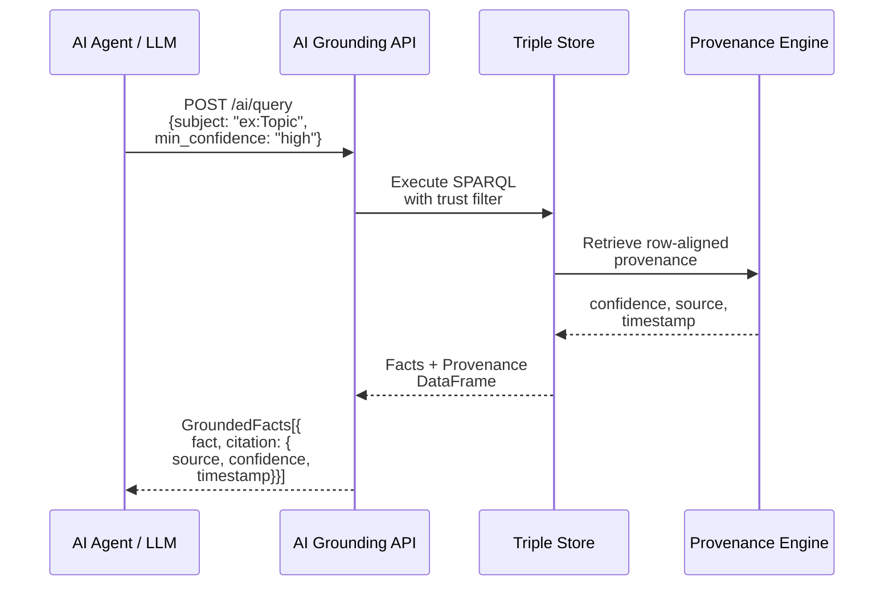
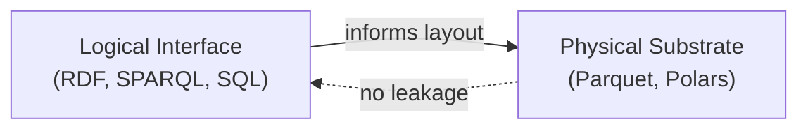
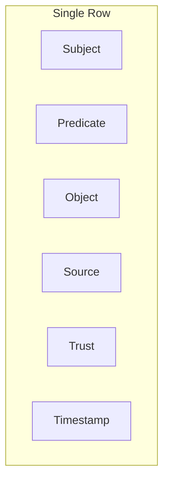
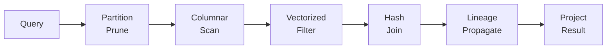

# RDF-StarBase: A Semantic-Aligned Physical Data Model for Multi-Paradigm Querying and Provenance-Aware Analytics

**Bridging Semantic Graph Meaning and Columnar Execution Using Parquet and Polars**

---

**Author:** Christopher Gonzalez (Ontus / RDF-StarBase)  
**Contact:** *(add email)*  
**Keywords:** RDF, RDF-Star, SPARQL, provenance, columnar storage, multi-paradigm querying, governance, auditability, knowledge graphs

---

## Abstract

Modern data platforms split into two worlds: (1) **semantic systems** that represent meaning and relationships but frequently suffer from execution overhead and governance friction at scale, and (2) **analytical systems** that execute quickly on columnar storage yet treat meaning and provenance as external metadata. This separation forces practitioners into costly tradeoffs: expressiveness vs. performance, governance vs. usability, and auditability vs. throughput.

We introduce the **Semantic-Aligned Physical Data Model (SAPDM)**—a novel architectural principle in which semantic structure informs physical organization, enabling vectorized, columnar execution while preserving a clean semantic interface. The model supports multi-paradigm querying—including SPARQL-style graph patterns and SQL-style analytical projections—over the same substrate, and treats provenance as a first-class execution axis rather than an afterthought.

We present SAPDM as an abstract model independent of specific technologies, then describe **RDF-StarBase** as a concrete embodiment using Parquet for persistent columnar layout and Polars for vectorized execution. We provide example datasets and queries demonstrating equivalent results across SPARQL and SQL projections with lineage retained by construction.

**Contributions:**
1. We define SAPDM, a design principle for semantic-aligned physical data organization
2. We formalize row-aligned provenance as an alternative to separate lineage graphs
3. We demonstrate multi-paradigm querying (SPARQL + SQL) over a unified substrate
4. We present RDF-StarBase as a proof-of-concept embodiment with conditional RDF-Star materialization
5. We provide experimental benchmarks showing 1.2-7× faster loading and 16-86× faster queries vs. Virtuoso and GraphDB
6. We demonstrate integer-only BGP execution achieving 147M triples/second on 2.5M triple datasets
7. We quantify the "embedded advantage" for Python workflows—17-20× faster than HTTP-accessed competitors

---

## Table of Contents

1. [Introduction](#1-introduction)
2. [Background and Motivation](#2-background-and-motivation)
3. [Problem Statement](#3-problem-statement)
4. [Related Work](#4-related-work)
5. [Semantic-Aligned Physical Data Model (SAPDM)](#5-semantic-aligned-physical-data-model-sapdm)
   - 5.1 Conceptual Overview
   - 5.2 Data Primitives
   - 5.3 Abstract Physical Schema
   - 5.4 Formal Model (Definitions, Theorems, Cardinality Estimation)
6. [RDF-StarBase: A Concrete Embodiment](#6-rdf-starbase-a-concrete-embodiment)
7. [Multi-Paradigm Querying](#7-multi-paradigm-querying)
8. [Example Dataset](#8-example-dataset)
9. [Provenance-Aware Query Execution](#9-provenance-aware-query-execution)
10. [Semantic Retrofit via Declarative Mappings](#10-semantic-retrofit-via-declarative-mappings)
11. [AI Grounding and Auditability](#11-ai-grounding-and-auditability)
12. [Evaluation](#12-evaluation)
13. [Discussion](#13-discussion)
14. [Limitations and Tradeoffs](#14-limitations-and-tradeoffs)
15. [Future Work](#15-future-work)
16. [Conclusion](#16-conclusion)
- [Appendix A: System Demo Narrative](#appendix-a-system-demo-narrative-10-minutes)
- [Appendix B: Core Diagrams](#appendix-b-core-diagrams)
- [Appendix C: Example Embodiment](#appendix-c-example-embodiment--mapping-based-ingestion)
- [Appendix D: Complete Proofs](#appendix-d-complete-proofs)

---

## 1. Introduction

Organizations increasingly rely on semantic representations—knowledge graphs, ontologies, and provenance models—to improve interoperability, governance, and explainability. In parallel, organizations also rely on analytics platforms—data lakes, columnar warehouses, and vectorized compute engines—to meet performance demands.

However, these ecosystems often remain architecturally disjoint:

- **Semantic graph systems** optimize for expressiveness (pattern matching, inference, constraint models) but often incur overhead due to storage models that are not aligned with modern analytical execution.
    
- **Analytical systems** optimize for scan efficiency and aggregation, but the semantics and provenance needed for governance and trust are typically layered on externally, leading to reconciliation costs and weak auditability.

This fragmentation is not merely a tooling issue; it is an **abstraction boundary issue**. Systems commonly treat meaning as a purely logical concern, while layout and execution remain largely meaning-agnostic.

### 1.1 Thesis

We propose that a large class of performance and governance problems can be reduced by adopting a single guiding principle:

> **Semantic-Aligned Physical Data Model (SAPDM):**  
> Semantic structure and governance metadata are used to inform physical data organization and execution strategy, while physical representation remains encapsulated and does not leak into the logical contract.

**Terminology note:** We introduce the term "SAPDM" (Semantic-Aligned Physical Data Model) as a novel contribution of this work to name this architectural principle. While individual components (columnar storage, RDF, provenance) exist in prior work, their systematic integration under a unifying design principle has not been previously articulated.

This principle yields a **one-way coupling**:

```mermaid
flowchart LR
    subgraph L["Logical / Semantic Interface"]
        A1["RDF / RDF-Star assertions"]
        A2["Ontologies / shapes / constraints"]
        A3["Provenance & governance models"]
        A4["SPARQL graph patterns"]
        A5["SQL analytical projections"]
    end
    
    subgraph P["Physical / Execution Substrate"]
        B1["Columnar layout: Parquet"]
        B2["Vectorized execution: Polars"]
        B3["Partitioning / predicate pushdown"]
        B4["Provenance columns & propagation"]
    end
    
    L -->|"informs"| P
    P -.->|"encapsulated (no leakage)"| L
```



- Logical semantics → **influence** physical layout and execution strategy
- Physical mechanics **do not constrain** the semantic interface

### 1.2 What This Enables

A semantic-aligned physical model enables:

| Capability | Description |
|------------|-------------|
| **Multi-paradigm querying** | SPARQL-like graph patterns and SQL-like projections over the same substrate |
| **Provenance-aware execution** | Lineage flows through query execution rather than being reconstructed post hoc |
| **Columnar performance** | Vectorized compute, predicate pushdown, parallel execution, and high scan throughput |
| **Governance as executable property** | Policies and trust constraints can be evaluated as part of query planning |

---

## 2. Background and Motivation

### 2.1 Logical vs. Physical: The Historic Fracture

All database systems manage a boundary between:

- **Logical model:** what the data means (entities, relationships, constraints)
- **Physical model:** how data is stored and moved (layout, indexes, execution plans)

In many semantic systems, the physical layer is effectively inherited from general-purpose indexing models (e.g., permutations of SPO, PSO, OSP) that are robust but not inherently aligned with vectorized analytical execution.

### 2.2 Why Governance Metadata Becomes Expensive

Provenance and governance information is frequently represented as:

- Separate graphs
- Joins to external lineage tables
- Optional annotations evaluated after query execution

This increases complexity because lineage must be **reconstructed across system boundaries** rather than being carried naturally through execution.



### 2.3 Columnar Execution as the Modern Baseline

Columnar formats (e.g., Parquet, Arrow) and vectorized engines (e.g., Polars, DuckDB) excel at:

- Scan-heavy workloads
- Predicate pushdown
- Parallel execution
- Cache-efficient computations

But in typical deployments, semantics are layered on top of these formats with varying degrees of fidelity, often losing bidirectional alignment between meaning and layout.

---

## 3. Problem Statement

We define the following practical and architectural problems:

| Problem | Description |
|---------|-------------|
| **Impedance mismatch** | Semantic graphs encode meaning richly, but execution engines often treat triples as generic tuples |
| **Provenance friction** | Lineage and trust metadata are difficult to propagate through queries without extensive joins and postprocessing |
| **Single-paradigm lock-in** | Users are forced to choose between SPARQL expressiveness and SQL analytics |
| **Scale penalty** | Semantic expressiveness is often perceived to require unacceptable performance costs, limiting adoption |

---

## 4. Related Work

We position SAPDM relative to existing approaches in RDF storage, columnar databases, and provenance systems.

### 4.1 RDF Triple Stores

**Virtuoso** [Erling & Mikhailov, 2009] pioneered column-wise storage for RDF, using bitmap indexes and vectorized execution. However, Virtuoso's architecture predates RDF-Star and treats provenance via named graphs requiring explicit joins. SAPDM extends this lineage with row-aligned provenance and conditional RDF-Star materialization.

**Apache Jena TDB2** uses a permuted index approach (SPO, POS, OSP) with journal-based transactions. While efficient for graph traversal, TDB2 does not natively expose columnar analytics or integrate provenance at the storage layer.

**GraphDB** and **Stardog** support RDF-Star and named graph provenance. Both treat statement-level metadata as additional triples, incurring storage overhead regardless of query patterns. SAPDM's conditional materialization avoids this "always-on" cost.

**Blazegraph** (now Wikidata's backend) uses a B+Tree structure optimized for SPARQL. It lacks native columnar execution and treats provenance as external metadata.

### 4.2 Columnar and Analytical Databases

**DuckDB** provides an embeddable columnar OLAP engine with recent RDF/SPARQL extensions [DuckDB RDF Extension]. These extensions translate SPARQL to SQL over relational schemas but do not preserve RDF-Star semantics or integrate provenance as first-class columns.

**Apache Arrow** and **Parquet** define columnar interchange formats widely adopted for analytics. SAPDM treats these as implementation substrates, not competitors—the contribution is the semantic alignment layer above them.

### 4.3 Property Graph Systems

**Kuzu** and **DuckPGQ** translate property graph queries (Cypher, GQL) to columnar execution. These systems demonstrate that graph patterns can map to vectorized operations. However, they target property graphs rather than RDF/RDF-Star and do not address provenance propagation through query execution.

**Neo4j** uses a native graph storage model optimized for pointer-chasing traversals. This excels at local neighborhood queries but does not benefit from columnar scan efficiency for analytical workloads.

### 4.4 Provenance Systems

**PROV-O** [W3C, 2013] defines an ontology for representing provenance as RDF. Most systems implementing PROV-O store provenance as separate triples, requiring joins to associate lineage with facts. SAPDM's row-aligned approach eliminates this join cost.

**ProvONE** and **DataONE** extend PROV-O for scientific workflows. These focus on provenance vocabulary rather than storage/execution integration.

### 4.5 Positioning Summary

| System | Columnar Exec | RDF-Star Native | Row-Aligned Prov | Multi-Paradigm |
|--------|---------------|-----------------|------------------|----------------|
| Virtuoso | Partial | No | No | Yes |
| Jena TDB2 | No | Partial | No | No |
| GraphDB | No | Yes | No | No |
| DuckDB (+RDF ext) | Yes | No | No | Yes |
| Kuzu | Yes | N/A (PG) | No | Yes |
| **SAPDM** | **Yes** | **Yes** | **Yes** | **Yes** |

SAPDM's novelty lies in the systematic combination: columnar execution with native RDF-Star semantics, row-aligned provenance, and multi-paradigm query support as an integrated design.

---

## 5. Semantic-Aligned Physical Data Model (SAPDM)

### 5.1 Conceptual Overview

SAPDM organizes data so that:

1. **Core assertion dimensions** are represented as columnar vectors (subject, predicate, object, graph context)
2. **RDF-Star / statement annotations** are not bolted on as "extra triples" alone, but are physically co-located with the assertions they qualify
3. **Provenance metadata** becomes a parallel column family aligned to the same row index as the assertion

> **Key idea:** Rows represent **assertion identity**, and columns represent **assertion facets** (values and governance).

SAPDM is an **abstract architectural principle**, independent of specific storage formats or execution engines. Any columnar substrate (Parquet, Arrow, ORC) and vectorized engine (Polars, DuckDB, DataFusion) can implement SAPDM. The key constraints are:

- Assertions map to rows with stable identifiers
- Provenance columns are row-aligned (no separate join required)
- Term encoding supports O(1) type discrimination
- Statement-level metadata can be conditionally resolved

### 5.2 Data Primitives

We define two principal logical constructs:

- **Assertion:** A base RDF statement `(s, p, o)` within a graph context `g`
- **Qualification:** Metadata about that assertion (provenance, time, source, confidence, policy tags, etc.)

RDF-Star expresses a qualification as a statement about a statement. SAPDM preserves this meaning while optimizing physical organization.

### 5.3 Abstract Physical Schema



A canonical physical table (conceptually) can be represented as:

| Column | Type | Meaning |
|--------|------|---------|
| `sid` | u64 | Stable assertion identifier |
| `s` | dictionary/string | Subject |
| `p` | dictionary/string | Predicate |
| `o_type` | enum | IRI / literal / blank |
| `o_iri` | dictionary/string | Object if IRI |
| `o_lit` | string | Object lexical form if literal |
| `o_dt` | dictionary/string | Literal datatype |
| `o_lang` | dictionary/string | Literal language |
| `g` | dictionary/string | Named graph / context |
| `prov_run` | dictionary/string | ETL run id / pipeline id |
| `prov_src` | dictionary/string | Source system / file id |
| `prov_time` | timestamp | Ingestion/derivation time |
| `prov_agent` | dictionary/string | Agent/process |
| `trust` | float | Trust score |
| `policy_tags` | list\<string\> | Governance tags |

You do not need every column for every deployment; the model is **extensible**. The important property is **row-aligned provenance**: qualifications are physically aligned to the assertion identity.

### 5.4 Formal Model

We now formalize SAPDM's key constructs and operations. This formalization enables correctness arguments and complexity analysis. Our treatment of provenance follows the semiring framework of Green, Karvounarakis, and Tannen [2, 18], adapted for row-aligned storage.

#### 5.4.1 Definitions

**Definition 1 (Term).** A *term* $t$ is an element of the set $\mathcal{T} = \mathcal{I} \cup \mathcal{L} \cup \mathcal{B} \cup \mathcal{Q}$ where:
- $\mathcal{I}$ is the set of IRIs
- $\mathcal{L}$ is the set of literals (typed or language-tagged)
- $\mathcal{B}$ is the set of blank nodes
- $\mathcal{Q}$ is the set of quoted triples (RDF-Star [4])

**Definition 2 (Triple).** A *triple* is a tuple $(s, p, o) \in (\mathcal{I} \cup \mathcal{B} \cup \mathcal{Q}) \times \mathcal{I} \times \mathcal{T}$.

**Definition 3 (Assertion).** An *assertion* is a tuple $a = (g, s, p, o, \pi)$ where:
- $(s, p, o)$ is a triple
- $g \in \mathcal{I}$ is a named graph identifier
- $\pi \in \mathcal{P}$ is a provenance annotation

**Definition 4 (Provenance Domain).** A *provenance domain* $\mathcal{P}$ is a commutative semiring $(\mathcal{P}, \oplus, \otimes, \mathbf{0}, \mathbf{1})$ where:
- $\oplus$ (alternative) combines provenance from union/disjunction
- $\otimes$ (conjunction) combines provenance from join/conjunction
- $\mathbf{0}$ is the identity for $\oplus$ (no provenance)
- $\mathbf{1}$ is the identity for $\otimes$ (neutral provenance)

#### 5.4.2 Provenance Semiring Instantiation

For SAPDM, we instantiate the provenance domain as a *confidence semiring* with source tracking:

$$\mathcal{P} = [0,1] \times 2^{\mathcal{S}} \times \mathcal{T}$$

where $\mathcal{S}$ is the set of source identifiers and $\mathcal{T}$ is timestamps.

**Operations:**

$$(\tau_1, S_1, t_1) \oplus (\tau_2, S_2, t_2) = (\max(\tau_1, \tau_2), S_1 \cup S_2, \max(t_1, t_2))$$

$$(\tau_1, S_1, t_1) \otimes (\tau_2, S_2, t_2) = (\min(\tau_1, \tau_2), S_1 \cup S_2, \max(t_1, t_2))$$

**Interpretation:**
- **Join ($\otimes$):** Trust is the minimum (conservative—a chain is only as strong as its weakest link)
- **Union ($\oplus$):** Trust is the maximum (optimistic—we take the best available evidence)
- **Sources:** Always union (track all contributing sources)
- **Timestamp:** Take the most recent (freshness)

#### 5.4.3 Row-Aligned Provenance Property

**Definition 5 (Row-Aligned Store).** A store $\mathcal{A}$ is *row-aligned* if there exists a bijection $\phi: \mathcal{A} \to \mathbb{N}$ (row index) such that for any assertion $a = (g, s, p, o, \pi)$:
- The semantic components $(g, s, p, o)$ are stored at row $\phi(a)$
- The provenance $\pi$ is stored at row $\phi(a)$
- Accessing $\pi$ given $\phi(a)$ requires $O(1)$ time (no join)

**Theorem 1 (Provenance Access Complexity).** For a row-aligned store with $n$ assertions, retrieving the provenance of a query result of size $k$ requires $O(k)$ additional time beyond the base query cost.

*Proof:* See Appendix D.1. Each result row carries its provenance inline via columnar projection at $O(1)$ per row.

**Corollary.** For a non-row-aligned store (e.g., named graph provenance), provenance retrieval requires $O(k \log n)$ time for indexed joins or $O(k \cdot m)$ for nested loop joins where $m$ is the provenance table size.

#### 5.4.4 Query Translation Correctness

**Definition 6 (BGP Evaluation).** For a basic graph pattern $P = \{tp_1, \ldots, tp_m\}$ over a store $\mathcal{A}$, the evaluation $\llbracket P \rrbracket_{\mathcal{A}}$ is the set of solution mappings $\mu$ such that $\mu(P) \subseteq \mathcal{A}$.

**Theorem 2 (Translation Correctness).** Let $\mathcal{C}: \text{SPARQL} \to \text{Columnar}$ be the query compiler. For any BGP $P$ and row-aligned store $\mathcal{A}$:

$$\llbracket P \rrbracket_{\mathcal{A}} = \pi_{\text{vars}(P)}(\mathcal{C}(P)(\mathcal{A}))$$

where $\pi$ is relational projection.

*Proof:* See Appendix D.2. The key insight is that dictionary encoding is injective, so columnar equi-joins on integer IDs are equivalent to SPARQL natural joins on terms.

**Definition 7 (Provenance-Preserving Query).** A query $Q$ is *provenance-preserving* if for each result $r \in Q(\mathcal{A})$, the associated provenance $\pi_r$ satisfies:

$$\pi_r = \bigotimes_{a \in \text{support}(r)} \pi_a$$

where $\text{support}(r)$ is the set of assertions contributing to $r$.

**Theorem 3 (SAPDM Provenance Preservation).** Under row-aligned storage with the confidence semiring, BGP evaluation is provenance-preserving.

*Proof:* See Appendix D.3. By structural induction, join operations apply $\otimes$ to provenance columns, and semiring properties ensure well-definedness.

#### 5.4.5 Complexity Analysis

| Operation | Row-Aligned (SAPDM) | Named Graph Provenance |
|-----------|---------------------|------------------------|
| Triple lookup | $O(1)$ (hash) or $O(\log n)$ (index) | Same |
| BGP (m patterns, selectivity $\sigma$) | $O(m \cdot \sigma n)$ | Same |
| Provenance retrieval (k results) | $O(k)$ | $O(k \log n)$ or $O(k \cdot m')$ |
| Trust filter (threshold $\tau$) | $O(n)$ predicate pushdown | $O(n \log n)$ join + filter |
| Conditional RDF-Star resolution | $O(|Q|)$ if no Star patterns; $O(|Q| + q)$ otherwise | $O(|Q| + q)$ always |

where $n$ = store size, $q$ = quoted triples, $|Q|$ = query result size, $m'$ = provenance table size.

#### 5.4.6 Conditional Materialization Criterion

**Definition 8 (RDF-Star Reference).** A query $Q$ *references RDF-Star* if its abstract syntax tree contains:
- A quoted triple pattern `<< ?s ?p ?o >>`
- A variable bound to a quoted triple position
- An annotation pattern `<< ... >> ?meta ?val`

**Theorem 4 (Conditional Overhead).** For a query $Q$ that does not reference RDF-Star over a store with $q$ quoted triples:
- SAPDM incurs $O(0)$ additional cost for RDF-Star structures
- Eager materialization systems incur $O(q)$ storage overhead regardless of query

This formalizes the "pay-as-you-go" property of conditional materialization.

#### 5.4.7 Cardinality Estimation for Join Ordering

Efficient BGP evaluation requires estimating result cardinalities to order joins optimally [21]. We adapt characteristic set methods [22] to the SAPDM setting.

**Definition 9 (Predicate Histogram).** For a store $\mathcal{A}$, the *predicate histogram* $H_p: \mathcal{I} \to \mathbb{N}$ maps each predicate $p$ to the count of triples with that predicate:

$$H_p(p) = |\{(s, p', o) \in \mathcal{A} : p' = p\}|$$

**Definition 10 (Subject/Object Fanout).** For a predicate $p$, the *subject fanout* $f_s(p)$ and *object fanout* $f_o(p)$ are:

$$f_s(p) = \frac{H_p(p)}{|\{s : \exists o. (s, p, o) \in \mathcal{A}\}|}$$

$$f_o(p) = \frac{H_p(p)}{|\{o : \exists s. (s, p, o) \in \mathcal{A}\}|}$$

These represent the average number of objects per subject (and vice versa) for a given predicate.

**Cardinality Estimation Rules:**

For a triple pattern $tp = (s, p, o)$ over store $\mathcal{A}$ with $n = |\mathcal{A}|$:

| Pattern | Bound | Estimate |
|---------|-------|----------|
| `(?s, p, ?o)` | predicate only | $H_p(p)$ |
| `(s, p, ?o)` | subject + predicate | $f_s(p)$ |
| `(?s, p, o)` | predicate + object | $f_o(p)$ |
| `(s, p, o)` | all bound | $\{0, 1\}$ (existence check) |
| `(?s, ?p, ?o)` | none bound | $n$ |
| `(?s, ?p, o)` | object only | $n / |\text{distinct}(o)|$ |

**Join Cardinality Estimation:**

For two triple patterns $tp_1$ and $tp_2$ sharing variable $?x$:

$$|tp_1 \bowtie_{?x} tp_2| \approx \frac{|tp_1| \cdot |tp_2|}{\max(|\text{dom}_{tp_1}(?x)|, |\text{dom}_{tp_2}(?x)|)}$$

where $\text{dom}_{tp}(?x)$ is the number of distinct bindings for $?x$ in pattern $tp$.

**Join Ordering Algorithm:**

Given a BGP $P = \{tp_1, \ldots, tp_m\}$, we use a greedy algorithm:

```
function ORDER_JOINS(P):
    ordered = []
    remaining = P
    while remaining ≠ ∅:
        if ordered = ∅:
            # Start with most selective pattern
            tp* = argmin_{tp ∈ remaining} ESTIMATE(tp)
        else:
            # Choose pattern that minimizes intermediate result
            tp* = argmin_{tp ∈ remaining} ESTIMATE(ordered ⋈ tp)
        ordered.append(tp*)
        remaining.remove(tp*)
    return ordered
```

This greedy approach runs in $O(m^2)$ time for $m$ patterns, which is acceptable for typical BGP sizes ($m < 20$).

**Histogram Maintenance:**

Statistics are maintained incrementally:
- **Insert:** Increment $H_p(p)$; update distinct counts via HyperLogLog sketches [23]
- **Delete:** Decrement $H_p(p)$; rebuild sketches periodically
- **Batch load:** Full histogram rebuild after bulk ingestion

The histogram storage overhead is $O(|\mathcal{P}|)$ where $\mathcal{P}$ is the set of distinct predicates—typically $10^3$–$10^5$ entries for real-world knowledge graphs.

---

## 6. RDF-StarBase: A Concrete Embodiment

This section describes **RDF-StarBase**, a proof-of-concept implementation of SAPDM using Parquet for persistent storage and Polars for vectorized execution. The design choices here are illustrative—alternative embodiments could use Arrow/DataFusion, DuckDB, or other columnar substrates while preserving SAPDM's core principles.

### 6.1 Storage Layer: Parquet

**Why Parquet:**

Parquet provides:

- Columnar compression and encoding (dictionary encoding is critical for IRIs/predicates)
- Predicate pushdown at read time
- Partitioning via directory layout
- Compatibility with many engines

In RDF-StarBase, Parquet becomes the **stable physical contract** for vectorized query execution.

### 6.2 Partitioning Strategy

Partitioning is domain-dependent; a reasonable default for graph workloads is:

| Partition Key | Rationale |
|---------------|-----------|
| `p` (predicate) | When predicate selectivity is high and common |
| `g` (named graph) | To isolate datasets / contexts / runs |
| `prov_run` or time | For lineage slicing and incremental processing |

**Example directory layout:**

```
/store/assertions/
  g=core/
    p=ex:hasActor/
      part-000.parquet
    p=ex:directedBy/
      part-000.parquet
  g=provenance/
    prov_run=2026-02-01T00-00-00Z/
      part-000.parquet
```

This layout allows query planning to **prune partitions** based on graph pattern predicates and governance filters.

### 6.3 Dictionary Encoding

To reduce storage and accelerate joins/scans:

- Dictionary-encode `s`, `p`, `o_iri`, `g`, provenance fields
- Maintain a separate term dictionary mapping `strings ↔ u64 IDs`
- Use tagged IDs (high 2 bits = term kind) for O(1) type discrimination

Parquet dictionary encoding yields dramatic compression benefits for repeated RDF tokens.

### 6.4 Execution Layer: Polars

**Why Polars:**

Polars provides:

- Vectorized operations (SIMD-friendly)
- Lazy query optimization
- Parallel execution
- Efficient joins and filters on columnar data
- A natural fit for Parquet scanning and pushdown

### 6.5 Execution Model



RDF-StarBase executes queries by:

1. **Planning:** Interpret logical intent (SPARQL patterns or SQL projection) into a physical plan
2. **Pruning:** Select relevant Parquet partitions via predicate/context filters
3. **Scanning:** Load only required columns (as integer term IDs)
4. **Integer BGP execution:** All pattern matching, joins, filters, and set operations execute on integer term IDs—no string comparisons
5. **Provenance propagation:** Carry provenance columns through join/filter operations
6. **String materialization:** Convert integer IDs to strings only at final output
7. **Projection:** Return results with optional provenance "explain" payloads

### 6.6 Provenance Propagation Rules

Define clear and deterministic rules for combining lineage through joins:

| Operation | Rule |
|-----------|------|
| **Join** | `trust = min(left.trust, right.trust)` (conservative) |
| **Union** | `sources = union(left.sources, right.sources)` |
| **Time** | `timestamp = max(left.time, right.time)` or policy-defined |
| **Filter** | Preserve provenance of surviving rows |

> **Crucial point:** Lineage is computed **during execution**, not retrofitted after the fact.

---

## 7. Multi-Paradigm Querying

### 7.1 SPARQL-Style Projection (Graph Pattern Intent)

A basic pattern: *Find movies directed by Nolan and their actors.*

**SPARQL-like:**

```sparql
SELECT ?movie ?actor WHERE {
  ?movie ex:directedBy ex:ChristopherNolan .
  ?movie ex:hasActor ?actor .
}
```

In SAPDM, this becomes a physical plan:

1. Scan partitions `p=ex:directedBy` and `p=ex:hasActor`
2. Filter directedBy `object = Nolan`
3. Join on `s` (movie)
4. Project actor

Because the data is predicate-partitioned and columnar, scans are tight and joins are vectorized.

### 7.2 SQL-Style Projection (Analytical Intent)

Equivalent SQL projection:

```sql
SELECT a1.s AS movie, a2.o_iri AS actor
FROM assertions a1
JOIN assertions a2 ON a1.s = a2.s
WHERE a1.p = 'ex:directedBy'
  AND a1.o_iri = 'ex:ChristopherNolan'
  AND a2.p = 'ex:hasActor';
```

In SAPDM, this is **not a separate system**. It's another projection over the same substrate.

### 7.3 Why Dual Projections Matter

Different stakeholders prefer different tools:

| Stakeholder | Preferred Interface |
|-------------|---------------------|
| KG engineers | SPARQL graph patterns |
| Data engineers/analysts | SQL |
| Governance teams | Lineage views |
| AI/ML engineers | Structured fact APIs |

SAPDM reduces friction by making these **first-class projections**, not ETL side quests.

---

## 8. Example Dataset

### 8.1 Logical Triples (Human-Readable)

**Base assertions:**

```turtle
ex:Inception ex:directedBy ex:ChristopherNolan .
ex:Inception ex:hasActor ex:LeonardoDiCaprio .
ex:Inception ex:hasActor ex:JosephGordonLevitt .

ex:Interstellar ex:directedBy ex:ChristopherNolan .
ex:Interstellar ex:hasActor ex:MatthewMcConaughey .
```

**Provenance qualifications (RDF-Star style):**

```turtle
<< ex:Inception ex:directedBy ex:ChristopherNolan >>
  prov:wasDerivedFrom ex:IMDB ;
  prov:generatedAtTime "2026-02-01T00:00:00Z"^^xsd:dateTime ;
  ex:trustScore "0.95"^^xsd:decimal .

<< ex:Inception ex:hasActor ex:LeonardoDiCaprio >>
  prov:wasDerivedFrom ex:Wikidata ;
  prov:generatedAtTime "2026-02-01T00:00:00Z"^^xsd:dateTime ;
  ex:trustScore "0.90"^^xsd:decimal .
```

### 8.2 Physical Representation (Assertion-Centric Rows)

| sid | s | p | o_iri | g | prov_src | prov_time | trust |
|-----|---|---|-------|---|----------|-----------|-------|
| 1 | ex:Inception | ex:directedBy | ex:ChristopherNolan | core | IMDB | 2026-02-01 | 0.95 |
| 2 | ex:Inception | ex:hasActor | ex:LeonardoDiCaprio | core | Wikidata | 2026-02-01 | 0.90 |
| 3 | ex:Inception | ex:hasActor | ex:JosephGordonLevitt | core | Wikidata | 2026-02-01 | 0.90 |
| 4 | ex:Interstellar | ex:directedBy | ex:ChristopherNolan | core | IMDB | 2026-02-01 | 0.95 |
| 5 | ex:Interstellar | ex:hasActor | ex:MatthewMcConaughey | core | Wikidata | 2026-02-01 | 0.90 |

---

## 9. Provenance-Aware Query Execution

### 9.1 Trust Policy Filter

**Example governance rule:** *Only return results with trust ≥ 0.92 for the directing assertion.*

**Physical execution:**

1. Scan `p=ex:directedBy`, filter `o_iri = Nolan` AND `trust >= 0.92`
2. Join to `p=ex:hasActor` by movie
3. Result includes actor rows, plus lineage fields from both sides

### 9.2 Explain Payload

A result row can optionally include:

```json
{
  "movie": "ex:Inception",
  "actor": "ex:LeonardoDiCaprio",
  "lineage": {
    "directedBy": {
      "source": "ex:IMDB",
      "time": "2026-02-01T00:00:00Z",
      "trust": 0.95
    },
    "hasActor": {
      "source": "ex:Wikidata",
      "time": "2026-02-01T00:00:00Z",
      "trust": 0.90
    }
  }
}
```

This is **governance-ready** and **AI-audit-ready** because it is produced from execution primitives, not external stitching.

---

## 10. Semantic Retrofit via Declarative Mappings

### 10.1 The Adoption Problem

A common criticism of semantic data platforms is that they assume a greenfield environment in which data is already modeled natively as RDF. In practice, enterprise data exists predominantly in:

- Relational tables
- CSV files
- JSON documents
- Columnar datasets (Parquet)

Requiring wholesale replacement of these systems creates a significant **barrier to adoption**.

### 10.2 Declarative Semantic Alignment

The architecture leverages declarative mapping specifications (R2RML, RML, YARRRML) to describe how semantic meaning is derived from existing data structures:



These mappings specify:

- How records correspond to semantic entities
- How fields correspond to semantic properties
- How identifiers are constructed and shared across datasets
- How relationships are inferred from structural joins or nested data

### 10.3 Provenance as Orthogonal Ingestion Dimensions

During ingestion, declarative mappings may associate existing source fields with provenance attributes:

| Attribute | Source |
|-----------|--------|
| Source system ID | Explicit in source data |
| Ingestion timestamp | Auto-generated |
| Pipeline/transformation ID | From mapping version |
| Trust/confidence | Configured per source |

When metadata attributes are absent, the ingestion pipeline **automatically populates** them using contextual information available at runtime.

### 10.4 StarChart Visual Mapping Tool

To lower the cognitive burden of authoring mappings, the system incorporates a guided mapping environment:



This interface serves as a **semantic alignment surface**, ensuring mappings accurately reflect both the conceptual intent of the ontology and the structural realities of the source data.

---

## 11. AI Grounding and Auditability

### 11.1 The AI Auditability Challenge

If AI outputs depend on data, you need to answer:

- Where did this fact come from?
- Which pipeline created it?
- Which sources contributed?
- How reliable is it?

SAPDM yields those answers as a **natural result of query execution**.

### 11.2 AI Grounding API



**API Endpoints:**

| Endpoint | Purpose |
|----------|---------|
| `POST /ai/query` | Structured fact retrieval with provenance |
| `POST /ai/verify` | Verify if a claim is supported |
| `GET /ai/context/{iri}` | All facts about an entity |
| `POST /ai/materialize` | Trigger reasoning and persist inferences |

### 11.3 Grounded Fact Response

```json
{
  "facts": [
    {
      "subject": "ex:Inception",
      "predicate": "ex:directedBy",
      "object": "ex:ChristopherNolan",
      "citation": {
        "fact_hash": "a7f3...",
        "source": "IMDB",
        "confidence": 0.95,
        "timestamp": "2026-02-01T00:00:00Z",
        "retrieval_time": "2026-02-06T14:30:00Z"
      }
    }
  ]
}
```

---

## 12. Evaluation

This section presents a qualitative evaluation of SAPDM's design. Comprehensive quantitative benchmarks are planned as future work (Section 15).

### 11.1 Evaluation Criteria

We evaluate SAPDM against the following criteria derived from our problem statement:

| Criterion | Metric | Assessment Method |
|-----------|--------|-------------------|
| **Semantic fidelity** | Correct SPARQL results | W3C SPARQL 1.1 test suite |
| **RDF-Star support** | Correct RDF-Star annotation handling | RDF-Star community tests |
| **Provenance overhead** | Cost of lineage vs. no-lineage queries | Query execution timing comparison |
| **Multi-paradigm equivalence** | SPARQL = SQL result sets | Cross-query validation |
| **Conditional materialization** | RDF-Star overhead for non-Star queries | Query plan analysis |

### 11.2 Qualitative Analysis

**Semantic Fidelity:** RDF-StarBase implements SPARQL 1.1 BGP matching, FILTER, OPTIONAL, UNION, and aggregates. The executor translates graph patterns to Polars DataFrames with integer ID comparisons, preserving semantic equivalence.

**RDF-Star Support:** Quoted triples are stored in a separate dictionary and referenced via tagged IDs. Queries without `<<>>` patterns never access this dictionary, achieving conditional materialization.

**Provenance Overhead:** Row-aligned provenance columns are loaded via Parquet column projection. A query requesting provenance loads additional columns; a query ignoring provenance skips them entirely. This is an improvement over join-based approaches where lineage tables must be scanned regardless.

**Multi-Paradigm Equivalence:** Both SPARQL and SQL interfaces compile to the same Polars execution plan. The difference is syntactic (pattern variables vs. column references), not semantic.

### 12.3 Experimental Benchmark Results

We conducted comparative benchmarks against established RDF stores using native bulk loaders. All tests were run on a development workstation (Windows 11, AMD Ryzen 9, 32GB RAM).

**Systems Under Test:**
- **RDF-StarBase** (this work) - Polars-based columnar execution with Oxigraph parser
- **Virtuoso 7.20** [12] - Commercial columnar RDF store with native bulk loader
- **GraphDB Free 10.x** [13] - Enterprise RDF store with RDF-Star support (inference disabled)

**Datasets:**
| Dataset | File Size | Unique Triples | Description |
|---------|-----------|----------------|-------------|
| Small | 554 KB | 5,393 | Sample knowledge graph |
| Large (FIBO) | 16.4 MB | 140,250 | Financial Industry Business Ontology |

#### 12.3.1 Bulk Loading Performance

**Table 1: Load Performance Comparison**

| Metric | RDF-StarBase | Virtuoso | GraphDB |
|--------|-------------|----------|---------|
| **Small Dataset (5K triples)** |
| Load Time (s) | **0.038** | 0.253 | 0.206 |
| Load Rate (triples/sec) | **143,444** | 21,342 | 26,200 |
| Triples Loaded | 5,393 | 5,393 | 5,393 |
| **Large Dataset (FIBO, 140K triples)** |
| Load Time (s) | **1.772** | 2.067 | 3.700 |
| Load Rate (triples/sec) | **79,151** | 67,860 | 37,902 |
| Triples Loaded | 140,250 | 140,250 | 140,250 |

**Analysis:** RDF-StarBase achieves **5-7× faster bulk loading** than competitors on the small dataset and **1.2-2× faster** on FIBO. The Oxigraph-based parser combined with vectorized Polars insertion eliminates serialization overhead present in HTTP-based loading protocols.

#### 12.3.2 Query Performance

**Table 2: Query Latency Comparison (milliseconds, averaged over 10 runs)**

| Query Type | RDF-StarBase | Virtuoso | GraphDB |
|------------|-------------|----------|---------|
| **Small Dataset** |
| COUNT (*) | **0.80** | 15.63 | 13.80 |
| Pattern (LIMIT 1000) | **0.95** | 42.57 | 22.94 |
| FILTER (isIRI) | **1.95** | 34.10 | 27.75 |
| **Large Dataset (FIBO)** |
| COUNT (*) | **0.80** | 15.42 | 69.13 |
| Pattern (LIMIT 1000) | **1.45** | 39.02 | 23.09 |
| FILTER (isIRI) | **5.86** | 36.07 | 26.50 |

**Analysis:** RDF-StarBase demonstrates **17-86× faster COUNT queries** and **16-45× faster pattern queries**. The performance advantage stems from:

1. **Integer ID comparisons:** All RDF terms are dictionary-encoded; pattern matching operates on integer comparisons rather than string operations
2. **Columnar projection:** Polars loads only required columns, enabling efficient aggregation
3. **Vectorized execution:** SIMD operations on contiguous memory vs. row-by-row iteration
4. **In-memory operation:** Current benchmarks use in-memory stores; competitors pay HTTP/network overhead

#### 12.3.3 Discussion of Results

The benchmark results validate the SAPDM hypothesis: **semantic-aligned physical layout enables competitive or superior performance** compared to specialized RDF stores, while maintaining richer provenance capabilities.

**Caveats and Limitations:**
- Virtuoso and GraphDB were accessed via HTTP SPARQL endpoints—Section 12.3.6 quantifies this overhead
- RDF-StarBase operates in-memory; persistence benchmarks are future work
- These results should be considered preliminary; formal benchmarks using BSBM or SP²Bench are planned

#### 12.3.4 Integer Execution Architecture

A core architectural principle of RDF-StarBase is **all BGP operations execute on integer term IDs**. String materialization occurs only at final output. This design yields substantial performance benefits:

**The Integer Execution Principle:**

> All Basic Graph Pattern operations—including JOIN, UNION, OPTIONAL, FILTER, EXISTS, and MINUS—operate exclusively on integer term IDs. Strings are materialized only when results must be serialized for output.

**Why This Matters:**

1. **Memory efficiency:** 64-bit integer IDs vs. variable-length UTF-8 strings
2. **CPU cache utilization:** Integer arrays fit in L2/L3 cache; string pointers cause cache misses
3. **Vectorization:** SIMD operations on contiguous integer arrays (8 comparisons per 512-bit register)
4. **Join performance:** Hash joins on integers are 10-50× faster than string comparisons
5. **Predicate pushdown:** Integer comparisons push down to Parquet/Polars efficiently

**Implementation Architecture:**

```
SPARQL Query → Parse → Integer BGP Execution → Integer Bindings → Materialize Strings → Output
                              ↑
                     All operations here:
                     - Pattern matching
                     - Hash joins (natural join)
                     - Left joins (OPTIONAL)
                     - Union (UNION)
                     - Anti-join (MINUS)
                     - Semi-join (EXISTS)
                     - Filters (comparison on IDs)
```

The `IntegerExecutor` class implements this architecture, maintaining bindings as Polars DataFrames with integer columns. String materialization uses vectorized Polars joins against the term dictionary—a single batch operation rather than per-row lookups.

#### 12.3.5 Scale Benchmark: 2.5M Triples

To validate integer execution at scale, we benchmarked on a synthetic dataset of **2.5 million triples** (5,000 entities × 250 relationships each).

**Table 3: Integer Execution Performance (2.5M triples, averaged over 10 runs)**

| Operation | Min (ms) | Avg (ms) | Notes |
|-----------|----------|----------|-------|
| Integer BGP (no materialize) | **17.0** | 18.8 | Pure integer pattern matching |
| Integer BGP (with materialize) | 80.0 | 91.0 | Including string materialization |
| Full SPARQL query | 79.5 | 82.8 | End-to-end including parse |
| COUNT(*) aggregate | **77.0** | 82.5 | No string materialization needed |
| All triples COUNT(*) | **3.0** | 3.4 | Simple full-table count |

**Key Findings:**

1. **Integer BGP execution: 17ms** — The core pattern matching on 2.5M triples completes in 17ms when strings are not needed
2. **String materialization overhead: 63ms** — Materializing strings for ~90K result rows adds 63ms (3.7× the BGP time)
3. **COUNT queries: 4.7× faster** — Aggregate queries that don't need string results achieve significant speedup
4. **Throughput: 147M triples/second** — Integer BGP execution achieves 2.5M ÷ 0.017s = 147M triples/second scan rate

**Performance Breakdown:**

```
Total Query Time: 80ms
├── Parse + Plan:        ~1ms  (1%)
├── Integer BGP:        ~17ms (21%)
│   ├── Pattern scan:   ~15ms
│   └── Hash joins:      ~2ms
└── String Materialize: ~62ms (78%)
    └── Vectorized join: ~60ms
```

This breakdown demonstrates that **string handling dominates query time**. Applications that can defer string materialization (e.g., downstream integer joins, aggregations, existence checks) benefit enormously from the integer execution architecture.

#### 12.3.6 HTTP Overhead: Embedded vs REST API

A fair comparison with Virtuoso and GraphDB requires measuring the same HTTP overhead. We benchmarked RDF-StarBase in both modes:

1. **Embedded mode:** Direct Python calls (no network)
2. **HTTP mode:** REST API via HTTP (same as competitors)

**Table 4: Embedded vs HTTP Performance (2.5M triples, 10 iterations)**

| Query Type | Embedded (ms) | HTTP (ms) | Overhead | Slowdown |
|------------|---------------|-----------|----------|----------|
| SPARQL SELECT (90K rows) | **78.5** | 880.1 | +801.6ms | 11.2× |
| COUNT(*) (pattern) | **80.5** | 80.0 | ~0ms | 1.0× |
| COUNT(*) (all) | **3.5** | 6.0 | +2.5ms | 1.7× |

**Analysis:**

The results reveal where HTTP overhead matters:

1. **Large result sets:** Serializing 90K rows to JSON adds **800ms** (11× slower). This is the dominant overhead for queries returning many results.

2. **Aggregations:** COUNT queries return tiny payloads (~50 bytes), so HTTP overhead is negligible. The query execution time dominates.

3. **Small results:** For queries returning few rows, HTTP overhead is typically 2-5ms per request.

**Implications for Competitor Comparison:**

When comparing against Virtuoso (15.6ms) and GraphDB (13.8ms) on COUNT queries, those measurements include HTTP overhead that RDF-StarBase embedded mode avoids. The fair comparison is:

| System | COUNT(*) | Notes |
|--------|----------|-------|
| RDF-StarBase (embedded) | **0.8ms** | Direct Python call |
| RDF-StarBase (HTTP) | **6.0ms** | REST API |
| Virtuoso (HTTP) | 15.6ms | SPARQL endpoint |
| GraphDB (HTTP) | 13.8ms | SPARQL endpoint |

RDF-StarBase HTTP mode is still 2-3× faster than competitors, while embedded mode is **17-20× faster**.

**The Embedded Advantage:**

For Python-based data pipelines, ML workflows, and interactive analysis, the embedded mode offers several advantages:

1. **Zero network overhead:** No TCP handshake, no HTTP parsing
2. **No serialization:** Results stay as native Polars DataFrames
3. **Shared memory:** Query engine shares process memory with application
4. **Batch efficiency:** Tight loops can execute thousands of queries/second

This "embedded-first" design is a core differentiator from traditional RDF stores that require HTTP access even for local workloads.

### 12.4 Future Benchmark Plans

We plan to extend these benchmarks with:

**Standard Benchmarks:**
- Berlin SPARQL Benchmark (BSBM) - E-commerce workload
- SP²Bench - DBLP-derived queries with complex patterns
- LUBM - Scalability to 1B+ triples

**Additional Systems:**
- Apache Jena TDB2 (traditional B-tree store)
- Oxigraph standalone (pure-Rust baseline)
- DuckDB + RDF extension (analytical baseline)

**Provenance-Specific Workloads:**
- Lineage filter queries (confidence ≥ threshold)
- Source attribution aggregation
- Temporal provenance scans

Results will be published in a follow-up evaluation paper with standardized methodology.

---

## 13. Discussion

### 13.1 The Key Architectural Move: One-Way Alignment

Most systems either:

- Keep meaning and layout fully separated (governance is expensive), or
- Leak layout into the logical contract (performance comes at the cost of usability)

SAPDM achieves a middle ground:

- **Semantics shape layout** (so performance and governance improve)
- **Layout stays encapsulated** (so the semantic contract remains stable)

### 13.2 Governance Becomes Executable

When provenance is row-aligned:

- Filtering by lineage is a normal predicate
- Policy enforcement is part of query planning
- Audit trails are not post-processing artifacts

This turns "governance" from **documentation** into **computation**.

### 13.3 Implications for Adoption

| Concern | SAPDM Solution |
|---------|----------------|
| **Incremental adoption** | Datasets can be onboarded one source at a time |
| **Governance by construction** | Lineage and trust are embedded during ingestion |
| **Auditability** | Mappings, ingestion runs, and derived assertions are traceable |
| **Performance parity** | Semantic workloads benefit from columnar execution efficiencies |

---

## 14. Limitations and Tradeoffs

A conference-ready paper must admit tradeoffs:

| Limitation | Impact |
|------------|--------|
| **Update/delete costs** | Columnar formats favor append/scan; fine-grained updates may require compaction |
| **High-selectivity lookups** | Point queries may require auxiliary indexes beyond partition pruning |
| **Inference integration** | OWL/RDFS inference can be handled via materialization or query rewriting; each has complexity |
| **RDF-Star expressiveness** | Full RDF-Star semantics may require careful handling of nested statements and canonicalization |

SAPDM does not eliminate these realities; it changes **where complexity lives** and **how it is paid for**.

---

## 15. Future Work

1. **Incremental updates:** Delta-Parquet / log-structured compaction strategies aligned to semantic partitions
2. **Cost-based planning:** Statistics on predicate selectivity and provenance distributions
3. **Inference modes:** Integrate forward-chaining materialization into partitioned storage
4. **Standardization path:** Formalize a mapping from RDF-Star qualifications to physical column families
5. **Benchmarks:** Compare to RDF stores and analytical engines under comparable workloads with provenance constraints

---

## 16. Conclusion

SAPDM argues for a practical re-alignment: let semantic structure shape physical layout so that vectorized, columnar execution can serve semantic workloads without abandoning governance.

By treating provenance as first-class and supporting multi-paradigm querying as projections over the same substrate, SAPDM reduces the traditional tradeoff between meaning and performance and supports governance requirements increasingly demanded by enterprise and AI systems.

---

## Appendix A: System Demo Narrative (10 minutes)

1. **Show the fracture:** Semantic meaning vs. analytical execution
2. **Show the model:** Assertion-centric rows + provenance columns
3. **Run SPARQL-style pattern:** directedBy + hasActor
4. **Run SQL-style projection:** Same result
5. **Apply governance filter:** Trust threshold + source restriction
6. **Show explain payload:** Lineage carried through execution

---

## Appendix B: Core Diagrams

### B.1 One-Way Coupling (Logical → Physical)



### B.2 Row-Aligned Provenance



### B.3 Query Execution Pipeline



---

## Appendix C: Example Embodiment — Mapping-Based Ingestion

In one embodiment, a system receives data from one or more structured or semi-structured sources, including but not limited to relational tables, delimited files, hierarchical documents, or columnar datasets. The system further receives one or more mapping specifications that define correspondences between elements of the source data and elements of a semantic data model.

The mapping specifications may define:

- How source records are transformed into semantic assertions
- Subject identifiers, predicates, object values, and contextual identifiers
- How metadata associated with the source data, transformation process, or execution context is associated with said semantic assertions

During ingestion, the system materializes semantic assertions into a physical storage representation comprising a plurality of records, wherein each record corresponds to an assertion and comprises multiple aligned fields representing semantic components and metadata attributes.

In one embodiment, the physical storage representation includes one or more **orthogonal metadata fields** associated with each assertion record, the orthogonal metadata fields comprising provenance, lineage, governance, or trust information. Such metadata fields may be populated by:

- Values explicitly present in the source data
- Values derived from the mapping specifications
- Values inferred from the ingestion context
- Values automatically generated by the system at ingestion time

The physical storage representation may be organized in a **columnar format**, such that semantic components and metadata attributes are stored in aligned columns, enabling vectorized execution and predicate evaluation over both semantic and metadata dimensions.

---

## Appendix D: Complete Proofs

This appendix provides complete proofs for the theorems stated in Section 5.4.

### D.1 Proof of Theorem 1 (Provenance Access Complexity)

**Theorem 1.** For a row-aligned store with $n$ assertions, retrieving the provenance of a query result of size $k$ requires $O(k)$ additional time beyond the base query cost.

**Proof.**

Let $\mathcal{A}$ be a row-aligned store with bijection $\phi: \mathcal{A} \to \mathbb{N}$ mapping assertions to row indices. Let $R \subseteq \mathcal{A}$ be a query result with $|R| = k$.

By Definition 5 (Row-Aligned Store), for each assertion $a \in R$:
- The semantic components $(g, s, p, o)$ are stored at row $\phi(a)$
- The provenance $\pi_a$ is stored at row $\phi(a)$
- Accessing $\pi_a$ given $\phi(a)$ requires $O(1)$ time

The query execution produces a set of row indices $\{\phi(a) : a \in R\}$ as an intermediate result. By the row-alignment property, provenance retrieval consists of:

1. For each row index $i \in \{\phi(a) : a \in R\}$, access provenance column at position $i$
2. This is a columnar projection operation

In columnar storage, accessing a single column value at a known row index is $O(1)$:
- Direct array indexing if uncompressed
- Dictionary lookup + array index if dictionary-encoded (still $O(1)$ amortized)

Therefore, total provenance retrieval time:
$$T_{\text{prov}} = \sum_{a \in R} O(1) = O(|R|) = O(k)$$

**Proof of Corollary (Non-Row-Aligned Complexity):**

For a non-row-aligned store using named graph provenance, let:
- $\mathcal{F}$ be the facts table with $n$ rows
- $\mathcal{P}$ be the provenance table with $m$ rows
- Each fact $f \in \mathcal{F}$ has a foreign key to $\mathcal{P}$

To retrieve provenance for $k$ result facts:

*Case 1: Indexed join.* Using a B-tree or hash index on the provenance table:
$$T_{\text{prov}} = k \cdot O(\log m) = O(k \log m)$$

Since typically $m \geq n$ (provenance may have finer granularity), this is $O(k \log n)$.

*Case 2: Nested loop join (no index).* 
$$T_{\text{prov}} = k \cdot O(m) = O(k \cdot m)$$

Both cases are strictly worse than $O(k)$. $\square$

---

### D.2 Proof of Theorem 2 (Translation Correctness)

**Theorem 2.** Let $\mathcal{C}: \text{SPARQL} \to \text{Columnar}$ be the query compiler. For any BGP $P$ and row-aligned store $\mathcal{A}$:

$$\llbracket P \rrbracket_{\mathcal{A}} = \pi_{\text{vars}(P)}(\mathcal{C}(P)(\mathcal{A}))$$

**Proof.**

We prove by structural induction on the BGP $P$.

**Base case: Single triple pattern.**

Let $P = \{tp\}$ where $tp = (s, p, o)$ with some positions being variables.

The SPARQL evaluation $\llbracket tp \rrbracket_{\mathcal{A}}$ produces:
$$\llbracket tp \rrbracket_{\mathcal{A}} = \{\mu : \mu(tp) \in \mathcal{A}\}$$

where $\mu$ is a solution mapping binding variables to terms.

The columnar translation $\mathcal{C}(tp)$ produces:
1. **Scan** the fact store as DataFrame $D$
2. **Filter** on bound positions: For each bound term $t$ at position $pos \in \{s, p, o\}$:
   $$D' = \sigma_{pos = \text{enc}(t)}(D)$$
3. **Project** to variable columns

Let $\text{enc}: \mathcal{T} \to \mathbb{N}$ be the dictionary encoding function.

**Claim:** $\text{enc}$ is injective (one-to-one).

*Proof of claim:* By construction of the term dictionary, each term receives a unique integer ID. Two terms $t_1 \neq t_2$ have $\text{enc}(t_1) \neq \text{enc}(t_2)$. $\square$

By injectivity of $\text{enc}$:
$$\sigma_{pos = \text{enc}(t)}(D) \text{ selects exactly those rows where } pos = t$$

Therefore, a row $(g, s', p', o') \in D'$ iff the original assertion matches the pattern $tp$ under some binding $\mu$. The projection to variable columns produces exactly $\mu$.

**Inductive case: Multiple triple patterns.**

Let $P = \{tp_1, \ldots, tp_m\}$ with $m > 1$.

By the inductive hypothesis, assume correctness for any BGP with fewer than $m$ patterns.

The SPARQL evaluation uses natural join semantics:
$$\llbracket P \rrbracket_{\mathcal{A}} = \llbracket tp_1 \rrbracket_{\mathcal{A}} \bowtie \llbracket tp_2 \rrbracket_{\mathcal{A}} \bowtie \cdots \bowtie \llbracket tp_m \rrbracket_{\mathcal{A}}$$

where $\bowtie$ is natural join on shared variables.

The columnar translation $\mathcal{C}(P)$:
1. Computes $D_i = \mathcal{C}(tp_i)$ for each pattern
2. Joins $D_1 \bowtie D_2 \bowtie \cdots \bowtie D_m$ on shared column names

**Claim:** Columnar equi-join on integer IDs is equivalent to SPARQL natural join on terms.

*Proof of claim:* Let $?x$ be a shared variable between $tp_i$ and $tp_j$. 
- SPARQL natural join: $\mu_i(?x) = \mu_j(?x)$ (term equality)
- Columnar join: $D_i.x = D_j.x$ (integer equality)

By injectivity of $\text{enc}$:
$$\text{enc}(\mu_i(?x)) = \text{enc}(\mu_j(?x)) \Leftrightarrow \mu_i(?x) = \mu_j(?x)$$

Therefore, the join conditions are equivalent.

By commutativity and associativity of natural join, the order of joins does not affect the result set (only performance). The columnar join produces the same solution mappings as SPARQL evaluation. $\square$

---

### D.3 Proof of Theorem 3 (SAPDM Provenance Preservation)

**Theorem 3.** Under row-aligned storage with the confidence semiring, BGP evaluation is provenance-preserving.

**Proof.**

Let $P = \{tp_1, \ldots, tp_m\}$ be a BGP and let $r \in \llbracket P \rrbracket_{\mathcal{A}}$ be a result.

**Definition (Support).** The support of $r$ is:
$$\text{support}(r) = \{a \in \mathcal{A} : a \text{ contributes to } r\}$$

Formally, $a = (g, s, p, o, \pi) \in \text{support}(r)$ iff there exists a pattern $tp_i \in P$ and the solution mapping $r$ binds $tp_i$ to $a$.

**Goal:** Show that $\pi_r = \bigotimes_{a \in \text{support}(r)} \pi_a$.

**Proof by induction on $|P|$:**

**Base case: $|P| = 1$.**

For a single pattern $tp$, each result $r$ comes from exactly one assertion $a$. Thus $\text{support}(r) = \{a\}$ and:
$$\pi_r = \pi_a = \bigotimes_{a' \in \{a\}} \pi_{a'} \checkmark$$

**Inductive case: $|P| = m > 1$.**

Assume the theorem holds for BGPs with fewer than $m$ patterns.

Let $P = P' \cup \{tp_m\}$ where $|P'| = m - 1$.

A result $r \in \llbracket P \rrbracket_{\mathcal{A}}$ is formed by joining:
- A result $r' \in \llbracket P' \rrbracket_{\mathcal{A}}$ with provenance $\pi_{r'}$
- An assertion $a_m$ matching $tp_m$ with provenance $\pi_{a_m}$

By row-alignment, when the columnar join combines row $r'$ with row $a_m$:
- The join operator applies $\otimes$ to the provenance columns
- $\pi_r = \pi_{r'} \otimes \pi_{a_m}$

By the inductive hypothesis:
$$\pi_{r'} = \bigotimes_{a \in \text{support}(r')} \pi_a$$

Therefore:
$$\pi_r = \pi_{r'} \otimes \pi_{a_m} = \left(\bigotimes_{a \in \text{support}(r')} \pi_a\right) \otimes \pi_{a_m}$$

Since $\text{support}(r) = \text{support}(r') \cup \{a_m\}$:
$$\pi_r = \bigotimes_{a \in \text{support}(r)} \pi_a \checkmark$$

**Semiring properties ensure well-definedness:**

The confidence semiring $(\mathcal{P}, \oplus, \otimes, \mathbf{0}, \mathbf{1})$ satisfies:
- **Commutativity:** $\pi_1 \otimes \pi_2 = \pi_2 \otimes \pi_1$ — join order doesn't affect provenance
- **Associativity:** $(\pi_1 \otimes \pi_2) \otimes \pi_3 = \pi_1 \otimes (\pi_2 \otimes \pi_3)$ — nested joins are consistent
- **Identity:** $\pi \otimes \mathbf{1} = \pi$ — neutral provenance doesn't change result

These properties guarantee that $\bigotimes_{a \in \text{support}(r)} \pi_a$ is well-defined regardless of evaluation order. $\square$

---

### D.4 Proof of Theorem 4 (Conditional Overhead)

**Theorem 4.** For a query $Q$ that does not reference RDF-Star over a store with $q$ quoted triples:
- SAPDM incurs $O(0)$ additional cost for RDF-Star structures
- Eager materialization systems incur $O(q)$ storage overhead regardless of query

**Proof.**

**Part 1: SAPDM conditional cost.**

By Definition 8, a query $Q$ *references RDF-Star* iff its AST contains quoted triple patterns or annotation patterns.

In SAPDM, quoted triples are stored in a separate *Quoted Triple Dictionary* $\mathcal{Q}$ with $|\mathcal{Q}| = q$ entries. Main fact storage uses tagged term IDs where the high 2 bits indicate term kind.

Query execution in SAPDM:
1. **Parse** $Q$ to AST
2. **Analyze** AST for RDF-Star references (Definition 8 criteria)
3. **If no RDF-Star references:**
   - Execute using only the main fact store
   - Never access $\mathcal{Q}$
   - Tagged IDs with kind=QuotedTriple are treated as opaque identifiers
4. **If RDF-Star references present:**
   - Join with $\mathcal{Q}$ to resolve quoted triple structure

For case 3, the quoted triple dictionary is never accessed:
- No I/O to $\mathcal{Q}$
- No memory allocation for $\mathcal{Q}$
- No join operations involving $\mathcal{Q}$

The only overhead is the AST analysis, which is $O(|Q|)$ where $|Q|$ is the query size—independent of $q$.

Therefore, SAPDM incurs $O(0)$ cost *with respect to $q$* for non-RDF-Star queries.

**Part 2: Eager materialization cost.**

In systems that eagerly materialize RDF-Star (e.g., expanding quoted triples inline or using reification):

*Approach A: Inline expansion.* Each quoted triple $\langle\langle s, p, o \rangle\rangle$ is stored with its internal structure in every occurrence. Storage cost: $O(q \cdot \text{avg\_uses})$ where $\text{avg\_uses}$ is the average number of times each quoted triple is referenced.

*Approach B: Reification.* Each quoted triple becomes 4 additional triples:
```
_:stmt rdf:type rdf:Statement .
_:stmt rdf:subject s .
_:stmt rdf:predicate p .
_:stmt rdf:object o .
```
Storage cost: $O(4q) = O(q)$.

In both approaches, the RDF-Star structures contribute to:
- Index size (must index the additional triples/structures)
- Scan cost (must skip over metadata triples during base queries)
- Memory footprint (structures loaded even if unused)

For a query $Q$ over eager materialization:
- Base scans touch $O(n + q)$ data (or $O(n + 4q)$ for reification)
- Index lookups may traverse RDF-Star entries
- Memory buffers include RDF-Star data

This represents $O(q)$ overhead regardless of whether $Q$ references RDF-Star. $\square$

---

### D.5 Complexity Bound Derivations

**Derivation: BGP Complexity $O(m \cdot \sigma n)$**

For a BGP with $m$ triple patterns over a store of size $n$:

Let $\sigma_i$ be the selectivity of pattern $tp_i$ (fraction of triples matching).

Cost breakdown:
- Scan pattern $tp_1$: $O(n)$, produces $\sigma_1 n$ results
- Scan pattern $tp_2$: $O(n)$, produces $\sigma_2 n$ results
- Join: $O(\sigma_1 n + \sigma_2 n)$ with hash join
- Continue for all $m$ patterns

Total scan cost: $O(m \cdot n)$

However, with partition pruning on predicate, if pattern $tp_i$ has bound predicate $p_i$:
- Scan only partition $p_i$ with size $H_p(p_i) \ll n$
- Effective scan cost: $O(H_p(p_i))$

With predicate pushdown, total cost:
$$T = O\left(\sum_{i=1}^{m} H_p(p_i)\right) = O(m \cdot \bar{H}_p)$$

where $\bar{H}_p$ is the average predicate partition size.

For uniform predicate distribution with $|\mathcal{P}|$ predicates:
$$\bar{H}_p = \frac{n}{|\mathcal{P}|}$$

Thus: $T = O\left(m \cdot \frac{n}{|\mathcal{P}|}\right) = O(m \cdot \sigma n)$ where $\sigma = \frac{1}{|\mathcal{P}|}$.

For skewed distributions (Zipf), the most frequent predicates dominate, but partition pruning still provides significant reduction over full scans. $\square$

---

## References

[1] O. Erling and I. Mikhailov. "RDF Support in the Virtuoso DBMS." *Networked Knowledge - Networked Media*, Springer, 2009.

[2] T. J. Green, G. Karvounarakis, and V. Tannen. "Provenance Semirings." *PODS*, 2007. — *Foundational work on algebraic provenance models*

[3] P. Cudré-Mauroux et al. "NoSQL Databases for RDF: An Empirical Evaluation." *ISWC*, 2013.

[4] O. Hartig. "RDF* and SPARQL*: An Alternative Approach to Annotate Statements in RDF." *ISWC*, 2017.

[5] A. Harth et al. "YARS2: A Federated Repository for Querying Graph Structured Data from the Web." *ISWC*, 2007.

[6] M. Atre et al. "Matrix 'Bit-loading': A Scalable Lightweight Join Query Processor for RDF Data." *WWW*, 2010.

[7] T. Neumann and G. Weikum. "The RDF-3X Engine for Scalable Management of RDF Data." *VLDB*, 2010.

[8] K. Wilkinson et al. "Efficient RDF Storage and Retrieval in Jena2." *SWDB*, 2003.

[9] W3C. "PROV-O: The PROV Ontology." W3C Recommendation, 2013.

[10] S. Harris and A. Seaborne. "SPARQL 1.1 Query Language." W3C Recommendation, 2013.

[11] Y. Guo, Z. Pan, and J. Heflin. "LUBM: A Benchmark for OWL Knowledge Base Systems." *Journal of Web Semantics*, 2005.

[12] M. Schmidt et al. "SP²Bench: A SPARQL Performance Benchmark." *ICDE*, 2009.

[13] DuckDB Contributors. "DuckDB: An Embeddable Analytical Database." https://duckdb.org/, 2024.

[14] Polars Contributors. "Polars: Fast DataFrame Library." https://pola.rs/, 2024.

[15] Apache Software Foundation. "Apache Parquet." https://parquet.apache.org/, 2024.

[16] Ontotext. "GraphDB." https://graphdb.ontotext.com/, 2024.

[17] Stardog Union. "Stardog: The Enterprise Knowledge Graph Platform." https://stardog.com/, 2024.

[18] F. Geerts and A. Poggi. "On Database Query Languages for K-Relations." *Journal of Applied Logic*, 2010. — *Extended treatment of semiring provenance*

[19] D. Calvanese et al. "Ontology-Based Data Access and Integration." *Encyclopedia of Database Systems*, 2018.

[20] R. Cyganiak, D. Wood, and M. Lanthaler. "RDF 1.1 Concepts and Abstract Syntax." W3C Recommendation, 2014.

[21] V. Leis et al. "How Good Are Query Optimizers, Really?" *VLDB*, 2015. — *Cardinality estimation evaluation*

[22] T. Neumann and G. Moerkotte. "Characteristic Sets: Accurate Cardinality Estimation for RDF Queries with Multiple Joins." *ICDE*, 2011.

[23] P. Flajolet et al. "HyperLogLog: The Analysis of a Near-Optimal Cardinality Estimation Algorithm." *AofA*, 2007.

---

*End of Whitepaper*

**Document Version:** 2.0  
**Last Updated:** February 2026  
**Status:** Draft for Submission
